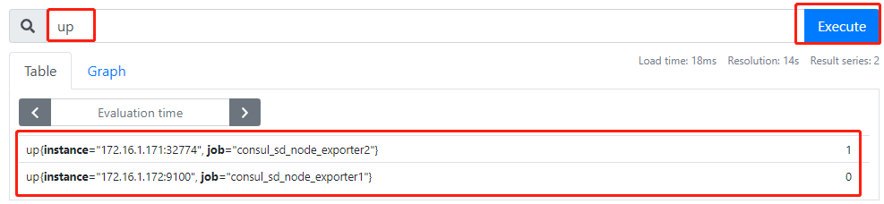
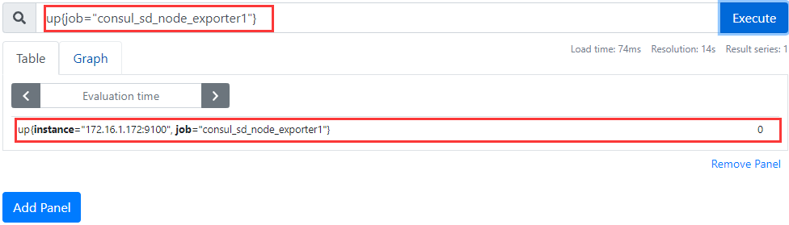
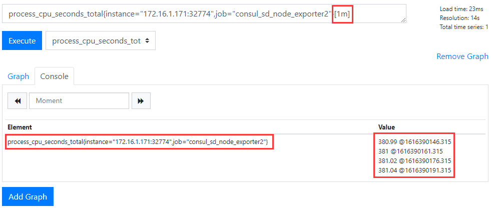
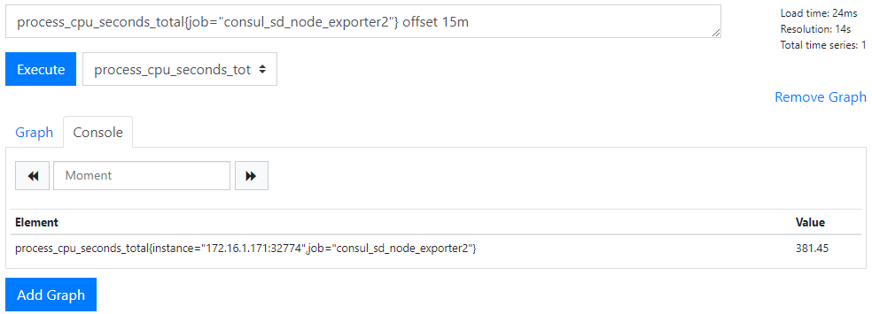
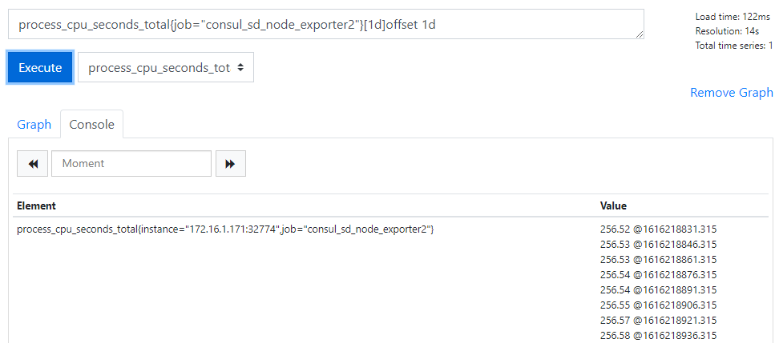
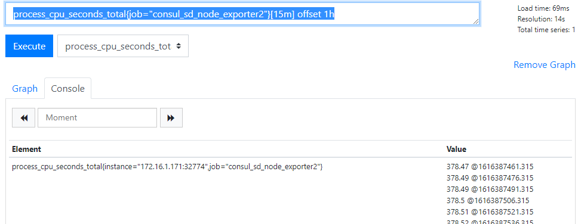
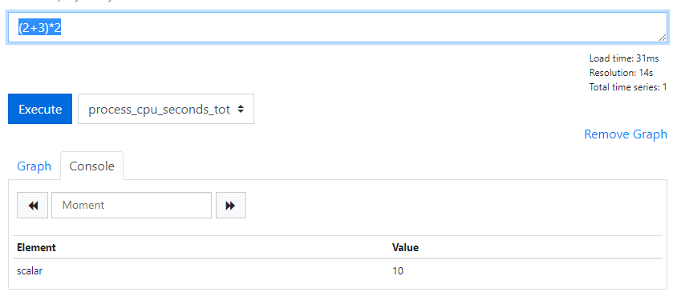
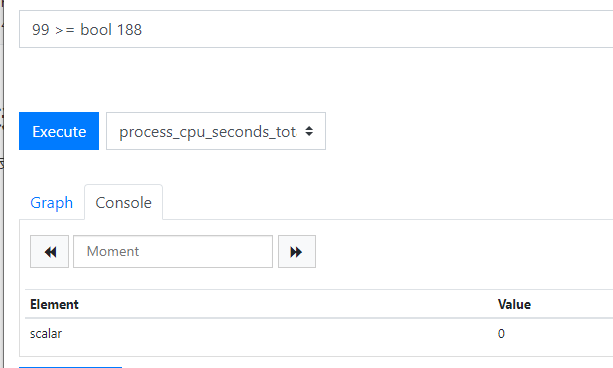

# PromQL

P94

prometheus提供了一种功能强大的表达式语言PromQL(Prometheus Query Language)，PromQL允许用户试试选择和汇聚时间序列诗句，是Prometheus自己开发的数据查询DSL

 ## 时序数据库

https://www.cnblogs.com/dhcn/p/12974931.html

## 数据模型与数据类型

一条`Prometheus`数据会包含一个指标名称(metric name)和一个或多个标签(label)以及`metric value`.`metric value`加一组 `label`作为唯一标签来定义`time series`。


* PromQL四种数据类型

  **即时向量/瞬时向量(instant vector): ** 是指同一时刻的一组时间序列，每个时间序列包含一个样本，所有样本共享相同的时间戳，即每个时间序列只有一个点

  **区间向量(rang vector):**  是指在任何一个时间范围内的一组时间序列，包含每个时间序列随时间变化的一系列数据点，这时每个时间序列有多个点。

  **标量(scalar):**  即纯量数据，一个简单的数字浮点值，只有一个数字，没有时序。

  **字符串(string):**  一个目前未被使用的简单字符串值。


## 时间序列选择器

P98

### Instant Vector Selectors

* 简单查询，直接输入指标名称

  

* 选择标签查询，通过`{}`中添加一组匹配的标签，可以进一步过滤这些时间序列`=、!=、=~、!~ `

  

在选择器中，相同标签名称可以有多个匹配模式 。例如，要查找安装在/run而不是/run/user下所有文件系统的大小：

```shell
node_filesystem_size_bytes{job="node",mountpoint=~"/run/.*",mountpoint!~"run/usre/.*"}
```

### Range Vector Selectors

范围持续时间添加到向量选择器末尾的`[]`中，以下截图`[1m]`表示1分钟内的3个样本值，实际操作使用带有`rate`或`avg_over_time`之类的函数范围向量，将向量作为参数，还支持其他时间单位`s(秒) h(时) d(天) w(周) y(年)`




### Offset modifier

即时向量表达式都以当前时间为基准，例如：

```shell
# 即时向量表达式，选择当前最新的数据
process_cpu_seconds_total{instance="172.16.1.171:32774",job="consul_sd_node_exporter2"}
# 区间向量表达式选择以当前时间为基准的15分钟内的数据
process_cpu_seconds_total{job="consul_sd_node_exporter2"}[15m]
```

如果想查询15分钟前的即时样本数据，就需要使用时间偏移操作`offset`

```shell
process_cpu_seconds_total{job="consul_sd_node_exporter2"} offset 15m

```





```shell
# 给出prometheus 1小时前内存使用量的变化
process_cpu_seconds_total{job="consul_sd_node_exporter2"} offset 1h
# 同样的操作方法也适用于区间向量
process_cpu_seconds_total{job="consul_sd_node_exporter2"}[15m] offset 1h
```




## PromQL聚合操作

P101

https://linux.ctolib.com/docs/sfile/prometheus-book/promql/prometheus-aggr-ops.html

Prometheus还提供了下列内置的聚合操作符，这些操作符作用域瞬时向量。可以将瞬时表达式返回的样本数据进行聚合，形成一个新的时间序列。

- `sum` (求和)
- `min` (最小值)
- `max` (最大值)
- `avg` (平均值)
- `stddev` (标准差，对一组数字分布情况的统计度量，用于检测异常值。例如，作业中的一个实例具有与平均值相差几个标准差的度量标准，这一现象表名他可能存在问题)
- `stdvar` (标准方差，是标准差的平方，用于统计)
- `count` (计数)
- `count_values` (对相同的value进行计数，用于统计时间序列中每一个样本值出现的次数)
- `bottomk` (后n条时序)
- `topk` (前n条时序)
- `quantile` (分布统计)

使用聚合操作的语法如下：

```shell
<aggr-op>([parameter,] <vector expression>) [without|by (<label list>)]
```

其中只有`count_values`, `quantile`, `topk`, `bottomk`支持参数(parameter)。

without用于从计算结果中移除列举的标签，而保留其它标签。by则正好相反，结果向量中只保留列出的标签，其余标签则移除。通过without和by可以按照样本的问题对数据进行聚合。

例如：监控指标名称`http_requests_total`包含`instance`,`handler`,`job`等指标，下列是求和示例

```shell
sum(http_requests_total) without (instance)
```

 等价于 :

```shell
sum(http_requests_total) by (code,handler,job,method)
```

 如果只需要计算整个应用的HTTP请求总量，可以直接使用表达式： 

```
sum(http_requests_total)
```

`count_values`用于时间序列中每一个样本值出现的次数。`count_values`会为每一个唯一的样本值输出一个时间序列，并且每一个时间序列包含一个额外的标签。 

```shell
count_values("count", http_requests_total)
```

`topk`和`bottomk`则用于对样本值进行排序，返回当前样本值前n位，或者后n位的时间序列。

获取HTTP请求数前5位的时序样本数据，可以使用表达式：

```shell
topk(5, http_requests_total)
```

`quantile`用于计算当前样本数据值的分布情况`quantile(φ, express)`其中0 ≤ φ ≤ 1。

例如，当φ为0.5时，即表示找到当前样本数据中的中位数：

```
quantile(0.5, http_requests_total)
```


## PromQL运算符

P102

https://linux.ctolib.com/docs/sfile/prometheus-book/promql/prometheus-promql-operators-v2.html

使用PromQL除了能够方便的按照查询和过滤时间序列以外，PromQL还支持丰富的操作符，用户可以使用这些操作符对进一步的对事件序列进行二次加工。这些操作符包括：数学运算符，逻辑运算符，布尔运算符等等。

### 数学运算

PromQL支持的所有数学运算符如下所示：

- `+` (加法)
- `-` (减法)
- `*` (乘法)
- `/` (除法)
- `%` (求余)
- `^` (幂运算)

运算符支持三类操作：scalar/scalar(标量/标量)之间操作；vector/scalar(瞬时向量/标量)之间操作；vector/vector(瞬时向量/瞬时向量)之间的操作。

**scalar/scalar(标量/标量)之间操作：**



**vector/scalar(瞬时向量/标量)之间操作:**

例如，我们可以通过指标node_memory_free_bytes_total获取当前主机可用的内存空间大小，其样本单位为Bytes。这是如果客户端要求使用MB作为单位响应数据，那只需要将查询到的时间序列的样本值进行单位换算即可：

```shell
node_memory_free_bytes_total / 1024 / 1024
或
process_virtual_memory_bytes/(1024*1024)
```

node_memory_free_bytes_total表达式会查询出所有满足表达式条件的时间序列，称该表达式为瞬时向量表达式，而返回的结果成为瞬时向量。

当`瞬时向量与标量`之间进行数学运算时，数学运算符会依次作用域瞬时向量中的每一个样本值，从而得到一组新的时间序列。

**vector/vector(瞬时向量/瞬时向量)之间的操作：**

而如果是瞬时向量与瞬时向量之间进行数学运算时，过程会相对复杂一点。 例如，如果我们想根据node_disk_bytes_written和node_disk_bytes_read获取主机磁盘IO的总量，可以使用如下表达式：

```
node_disk_bytes_written + node_disk_bytes_read
```

那这个表达式是如何工作的呢？依次找到与左边向量元素匹配（标签完全一致）的右边向量元素进行运算，如果没找到匹配元素，则直接丢弃。同时新的时间序列将不会包含指标名称。 该表达式返回结果的示例如下所示：

```
{device="sda",instance="localhost:9100",job="node_exporter"}=>1634967552@1518146427.807 + 864551424@1518146427.807
{device="sdb",instance="localhost:9100",job="node_exporter"}=>0@1518146427.807 + 1744384@1518146427.807
```


### 使用布尔运算过滤时间序列

目前，Prometheus支持以下布尔运算符如下：

- `==` (相等)
- `!=` (不相等)
- `>` (大于)
- `<` (小于)
- `>=` (大于等于)
- `<=` (小于等于)

关系运算符支持三类操作：scalar/scalar(标量/标量)之间操作；vector/scalar(瞬时向量/标量)之间操作；vector/vector(瞬时向量/瞬时向量)之间的操作。有些情况可以通过云三幅之后只用`bool`修饰符，从而不对时间序列过滤，直接放回 0(false)或者 1(true)

**scalar/scalar(标量/标量)之间操作：必须使用bool修饰符**

布尔运算符的默认行为是对时序数据进行过滤。而在其它的情况下我们可能需要的是真正的布尔结果。例如，只需要知道当前模块的HTTP请求量是否>=1000，如果大于等于1000则返回1（true）否则返回0（false）。这时可以使用bool修饰符改变布尔运算的默认行为。 例如：

```
http_requests_total > bool 100
```

使用bool修改符后，布尔运算不会对时间序列进行过滤，而是直接依次瞬时向量中的各个样本数据与标量的比较结果0或者1。从而形成一条新的时间序列。

```
http_requests_total{code="200",handler="query",instance="localhost:9090",job="prometheus",method="get"}  1
http_requests_total{code="200",handler="query_range",instance="localhost:9090",job="prometheus",method="get"}  0
```

同时需要注意的是，如果是在两个标量之间使用布尔运算，则必须使用bool修饰符

```
2 == bool 2 # 结果为1
```




**vector/scalar(瞬时向量/标量)之间操作:**

在PromQL通过标签匹配模式，用户可以根据时间序列的特征维度对其进行查询。而布尔运算则支持用户根据时间序列中样本的值，对时间序列进行过滤。

例如，通过数学运算符我们可以很方便的计算出，当前所有主机节点的内存使用率：

```
(node_memory_bytes_total - node_memory_free_bytes_total) / node_memory_bytes_total
```

而系统管理员在排查问题的时候可能只想知道当前内存使用率超过95%的主机呢？通过使用布尔运算符可以方便的获取到该结果：

```
(node_memory_bytes_total - node_memory_free_bytes_total) / node_memory_bytes_total > 0.95
```

瞬时向量与标量进行布尔运算时，PromQL依次比较向量中的所有时间序列样本的值，如果比较结果为true则保留，反之丢弃。

**vector/vector(瞬时向量/瞬时向量)之间的操作：**

瞬时向量与瞬时向量直接进行布尔运算时，同样遵循默认的匹配模式：依次找到与左边向量元素匹配（标签完全一致）的右边向量元素进行相应的操作，如果没找到匹配元素，则直接丢弃。


### 逻辑运算符

使用瞬时向量表达式能够获取到一个包含多个时间序列的集合，我们称为瞬时向量。 通过集合运算，可以在两个瞬时向量与瞬时向量之间进行相应的集合操作。目前，Prometheus支持以下逻辑运算符：

- `and` (并且)
- `or` (或者)
- `unless` (排除)

**vector1 and vector2** 会产生一个由vector1的元素组成的新的向量。该向量包含vector1中完全匹配vector2中的元素组成。

**vector1 or vector2** 会产生一个新的向量，该向量包含vector1中所有的样本数据，以及vector2中没有与vector1匹配到的样本数据。

**vector1 unless vector2** 会产生一个新的向量，新向量中的元素由vector1中没有与vector2匹配的元素组成。

### 操作符优先级

对于复杂类型的表达式，需要了解运算操作的运行优先级

例如，查询主机的CPU使用率，可以使用表达式：

```
100 * (1 - avg (irate(node_cpu{mode='idle'}[5m])) by(job) )
```

其中`irate`是PromQL中的内置函数，用于计算区间向量中时间序列每秒的即时增长率。

在PromQL操作符中优先级由高到低依次为：

1. `^`
2. `*, /, %`
3. `+, -`
4. `==, !=, <=, <, >=, >`
5. `and, unless`
6. `or`

### 匹配模式详解

向量与向量之间进行运算操作时会基于默认的匹配规则：依次找到与左边向量元素匹配（标签完全一致）的右边向量元素进行运算，如果没找到匹配元素，则直接丢弃。

接下来将介绍在PromQL中有两种典型的匹配模式：一对一（one-to-one）,多对一（many-to-one）或一对多（one-to-many）。

#### 一对一匹配

一对一匹配模式会从操作符两边表达式获取的瞬时向量依次比较并找到唯一匹配(标签完全一致)的样本值。默认情况下，使用表达式：

```
vector1 <operator> vector2
```

在操作符两边表达式标签不一致的情况下，可以使用`on(label list)`或者`ignoring(label list)`来修改便签的匹配行为。使用`ignoring`可以在匹配时忽略某些便签。而`on`则用于将匹配行为限定在某些便签之内。

```
<vector expr> <bin-op> ignoring(<label list>) <vector expr>
<vector expr> <bin-op> on(<label list>) <vector expr>
```

例如当存在样本：

```
method_code:http_errors:rate5m{method="get", code="500"}  24
method_code:http_errors:rate5m{method="get", code="404"}  30
method_code:http_errors:rate5m{method="put", code="501"}  3
method_code:http_errors:rate5m{method="post", code="500"} 6
method_code:http_errors:rate5m{method="post", code="404"} 21

method:http_requests:rate5m{method="get"}  600
method:http_requests:rate5m{method="del"}  34
method:http_requests:rate5m{method="post"} 120
```

使用PromQL表达式：

```
method_code:http_errors:rate5m{code="500"} / ignoring(code) method:http_requests:rate5m
```

该表达式会返回在过去5分钟内，HTTP请求状态码为500的在所有请求中的比例。如果没有使用ignoring(code)，操作符两边表达式返回的瞬时向量中将找不到任何一个标签完全相同的匹配项。

因此结果如下：

```
{method="get"}  0.04            //  24 / 600
{method="post"} 0.05            //   6 / 120
```

同时由于method为put和del的样本找不到匹配项，因此不会出现在结果当中。

#### 多对一和一对多

多对一和一对多两种匹配模式指的是“一”侧的每一个向量元素可以与"多"侧的多个元素匹配的情况。在这种情况下，必须使用group修饰符：`group_left`或者`group_right`来确定哪一个向量具有更高的基数（充当“多”的角色）。

```
<vector expr> <bin-op> ignoring(<label list>) group_left(<label list>) <vector expr>
<vector expr> <bin-op> ignoring(<label list>) group_right(<label list>) <vector expr>
<vector expr> <bin-op> on(<label list>) group_left(<label list>) <vector expr>
<vector expr> <bin-op> on(<label list>) group_right(<label list>) <vector expr>
```

多对一和一对多两种模式一定是出现在操作符两侧表达式返回的向量标签不一致的情况。因此需要使用ignoring和on修饰符来排除或者限定匹配的标签列表。

例如,使用表达式：

```
method_code:http_errors:rate5m / ignoring(code) group_left method:http_requests:rate5m
```

该表达式中，左向量`method_code:http_errors:rate5m`包含两个标签method和code。而右向量`method:http_requests:rate5m`中只包含一个标签method，因此匹配时需要使用ignoring限定匹配的标签为code。 在限定匹配标签后，右向量中的元素可能匹配到多个左向量中的元素因此该表达式的匹配模式为多对一，需要使用group修饰符group_left指定左向量具有更好的基数。

最终的运算结果如下：

```
{method="get", code="500"}  0.04            //  24 / 600
{method="get", code="404"}  0.05            //  30 / 600
{method="post", code="500"} 0.05            //   6 / 120
{method="post", code="404"} 0.175           //  21 / 120
```

> 提醒：group修饰符只能在比较和数学运算符中使用。在逻辑运算and,unless和or才注意操作中默认与右向量中的所有元素进行匹配。


