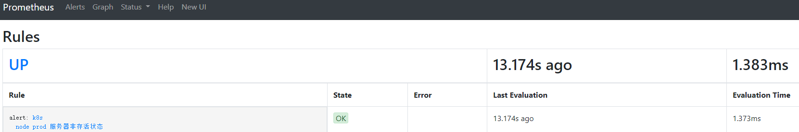
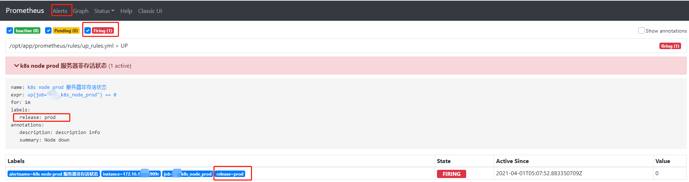
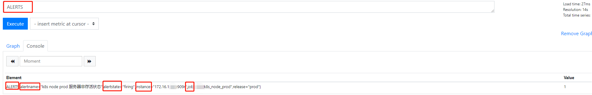
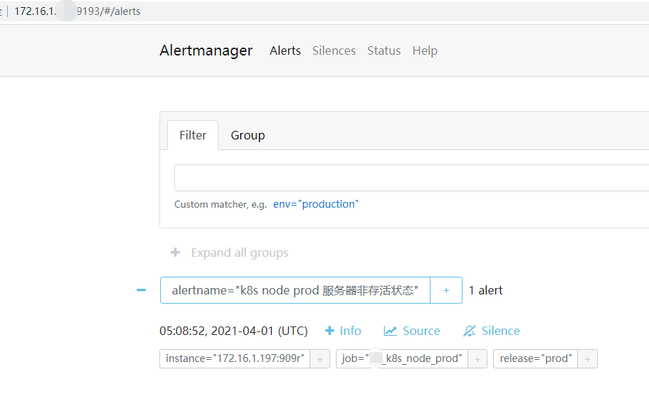
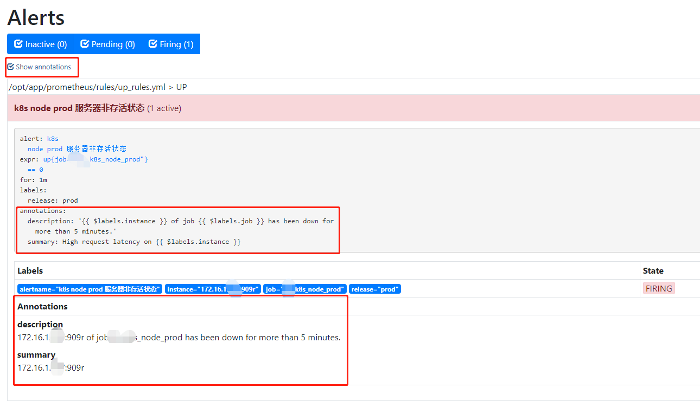

# AlterManager

[官网](https://prometheus.io/docs/alerting/latest/configuration/)

P116

## 安装

https://github.com/prometheus/alertmanager/releases/download/v0.21.0/alertmanager-0.21.0.linux-amd64.tar.gz

下载二进制包运行即可

主要配置

```shell
--data.retention=120h  历史数据保存时间，默认120h
--storage.path="data/" 数据保存路劲
--web.listen-address=":9093"  监听端口
--web.external-url=WEB.EXTERNAL-URL  http://{ip或域名}:9093
....
```

docker安装

```shell
docker run -d -p 9093:9093 -v /data/alertmanager/config.yml:/etc/alertmanager/alertmanager.yml \
prom/alertmanager
```


## 配置组件

* global 全局配置
* templates 报警模版
* route 报警路由
* receiver 接收器
* inhibit_rules 抑制规则

### global 

全局公共配置，可以作为其他配置项的默认值，也可以被其他配置项中的设置覆盖掉

### templates 报警模版

自定义报警通知的外观和对应报警数据,自动加载该路劲下的模版文件

```yaml
templates:
- '/data1/alertmanager/templates/*.tmpl'
```

### route 报警路由

[alertManager router流程](https://prometheus.io/webtools/alerting/routing-tree-editor/)

将报警发送到receiver制定的目的地址的规则

```yaml
[ receiver: <string> ]
[ group_by: '[' <labelname>, ... ']' ]
[ continue: <boolean> | default = false ]
match:
  [ <labelname>: <labelvalue>, ... ]
match_re:
  [ <labelname>: <regex>, ... ]
[ group_wait: <duration> | default = 30s ]
[ group_interval: <duration> | default = 5m ]
[ repeat_interval: <duration> | default = 4h ]
routes:
  [ - <route> ... ]
```

 首先每一个告警都会从配置文件中顶级的route进入路由树，需要注意的是顶级的route必须匹配所有告警(即不能有任何的匹配设置)，每一个路由都可以定义自己的接受器。告警进入到顶级路由后会遍历所有的子节点。

* receiver

  配置要发送报警的接收器名称

* group_by

  制定要分组的标签，如果报警中包含的标签符合group_by中制定的标签名称，则这些报警会被合并为一个通知发送给接收器，实现报警分组

* continue

   如果设置了**continue**的值为false，则告警在匹配到第一个子节点之后终止后续匹配。如果**continue**为true，报警则会继续进行后续子节点的匹配。如果当前告警匹配不到任何的子节点，那么该告警将会基于当前路由节点的接收器配置方式进行处理。 

* match

  通过设置**match**规则判断当前告警中是否存在标签labelname并且其值等于labelvalue 

* match_re

   设置**match_re**验证当前告警标签的值是否满足正则表达式的内容 

* group_wait

   如果在等待时间内当前group接收到了新的告警，这些告警将会合并为一个通知向receiver发送 

* group_interval

  相同的Gourp之间发送告警通知的时间间隔 

* repeat_interval

  设置报警发送成功之后再次发送完全相同报警的时间间隔

* routes

  子路由节点匹配设置

示例：

```yaml
route:
  receiver: 'my-receiver'   # 默认报警都发送给my-receiver
  group_wait: 30s           # 30s内报警合并为一条
  group_interval: 5m        # 同组发送报警间隔
  repeat_interval: 4h       # 报警发送成功之后再次发送完全相同报警的时间间隔
  group_by: [cluster, alertname]  # 按cluster，alertname标签分组，报警合为一直通知发送
  routes:                   # 子路由设置
  - receiver: 'database-pager'    # 符合匹配标签mysql|mongodb的发送给db管理员
    group_wait: 10s
    match_re:
      service: mysql|mongodb
  - receiver: 'frontend-pager'    # 符合匹配[product, environment]的发送给前端开发
    group_by: [product, environment]
    match:
      team: frontend
```


### receiver 接收器

 告警接收器可以通过以下形式进行配置： 

```yaml
receivers:
  - <receiver> ...
```

 每一个receiver具有一个全局唯一的名称，并且对应一个或者多个通知方式： 

```yaml
name: <string>                   # 设置接收器名称
email_configs:                   # email报警
  [ - <email_config>, ... ]
hipchat_configs:
  [ - <hipchat_config>, ... ]
pagerduty_configs:
  [ - <pagerduty_config>, ... ]
pushover_configs:
  [ - <pushover_config>, ... ]
slack_configs:
  [ - <slack_config>, ... ]
opsgenie_configs:
  [ - <opsgenie_config>, ... ]
webhook_configs:                # webhook报警
  [ - <webhook_config>, ... ]
victorops_configs:
  [ - <victorops_config>, ... ]
wechat_configs:                 # 微信报警支持
  [ - <wechat_configs>, ... ]
```


### inhibit_rules 屏蔽告警通知

**尽量避免source_match和source_match_re同时使用**

 inhibit_rules定义一组告警的抑制规则： 

```yaml
inhibit_rules:
  [ - <inhibit_rule> ... ]
```

 每一条抑制规则的具体配置如下： 

```yaml
target_match:
  [ <labelname>: <labelvalue>, ... ]
target_match_re:
  [ <labelname>: <regex>, ... ]

source_match:
  [ <labelname>: <labelvalue>, ... ]
source_match_re:
  [ <labelname>: <regex>, ... ]

[ equal: '[' <labelname>, ... ']' ]
```

示例：

```yaml
inhibit_rules:              # 抑制规则
- source_match:             # 当存在源标签报警触发时抑制含有目标标签的报警
    alertname: NodeDown
    severity: critical
  target_match:            
    severity: critical      # 标签匹配
  equal:                    # 保证该配置标签内容相同才会被抑制
    - node
    - rack
```


### alertmanager默认配置

```yaml
# cat alertmanager.yml
global:                                     # 全局配置模块
  resolve_timeout: 5m                       # 用于设置处理超时时间，默认5分钟

route:                                      # 路由配置模块
  group_by: ['alertname']                   # 报警分组
  group_wait: 10s                           # 10s内收到的同组报警合并为一条发送
  group_interval: 10s                       # 同组发送报警通知的时间间隔
  repeat_interval: 1h                       # 完全相同报警重复发送周期
  receiver: 'web.hook'                      # 对应下方web.hook接收器
receivers:                                  # 接收器
- name: 'web.hook'                          # 接收器名
  webhook_configs:                          # 接收器地址设置
  - url: 'http://127.0.0.1:5001/'
inhibit_rules:                              # 报警抑制规则
  - source_match:                           # 当存在源标签报警触发时抑制还有目标标签的报警
      severity: 'critical'
    target_match:                           # 目标标签
      severity: 'warning'
    equal: ['alertname', 'dev', 'instance'] # 保证该配置下标签内容相同才会被抑制
```


## 与Prometheus关联

* prometheus关联altermanager组件访问地址

  `cat /etc/prometheus/prometheus.yml`

  ```yaml
  alerting:
    alertmanagers:
    - static_configs:
      - targets:
         - 172.16.1.171:32776
  ```

* 添加监控alertmanager

  ```yaml
    - job_name: 'Alertmanager' 
      static_configs:
      - targets: [172.16.1.171:32776]
  ```

  

## 报警规则

在`Prometheus server`中使用`promQL`配置实际报警触发条件， Prometheus后端对这些触发规则进行周期性计算，当满足触发条件后则会触发告警通知。 默认情况下，用户可以通过Prometheus的Web界面查看这些告警规则以及告警的触发状态。当`Promthues`与`Alertmanager`关联之后，可以将告警发送到外部服务如`Alertmanager`中并通过`Alertmanager`可以对这些告警进行进一步的处理。 

`Prometheus`默认对报警规则计算周期为1m，可以使用`evaluation_interval`进行调整

```yaml
global:
  [ evaluation_interval: <duration> | default = 1m ] # promQL触发条件计算周期
  scrape_interval: 10s    # 收集监控目标信息的周期  并且配置对应告警规则
rule_files:
  [ - <filepath_glob> ... ]
```

**报警规则文件管理**

报警规则可以直接指定文件，也可以存放到特定的目录下。

```yaml
rule_files:
  - "first_rules.yml"
  - "/data/prometheus/rules/*_rules.yml"
```

**报警信息生命周期的三种状态**

* Interval

  没有满足触发条件，报警未激活

* Pending

  已满足触发条件，未满for足持续时间

* Firing

  已满足触发条件，并且满足for持续时间，即当前为报警状态

### 报警规则定义

```yaml
groups:
- name: example
  rules:
  - alert: HighErrorRate
    expr: job:request_latency_seconds:mean5m{job="myjob"} > 0.5
    for: 10m
    labels:
      severity: page
    annotations:
      summary: High request latency
      description: description info
```

在告警规则文件中，可以将一组相关的规则设置定义在一个group下。在每一个group中可以定义多个告警规则(rule)。一条告警规则主要由以下几部分组成：

- alert：

  告警规则的名称。

- expr：

  基于PromQL表达式告警触发条件，用于计算是否有时间序列满足该条件。

- for：

  评估等待时间，可选参数。用于表示只有当触发条件持续一段时间后才发送告警。在等待期间新产生告警的状态为pending。

- labels：

  自定义标签，允许用户指定要附加到告警上的一组附加标签。

- annotations：

  用于指定一组附加信息，比如用于描述告警详细信息的文字等。

Prometheus根据global.evaluation_interval定义的周期计算PromQL表达式。如果PromQL表达式能够找到匹配的时间序列则会为每一条时间序列产生一个告警实例。


### 配置一个告警

#### 服务器存活

`prometheus server`

```shell
$ mkdir /opt/app/prometheus/rules/

$ vim /opt/app/prometheus/prometheus.yml
rule_files:
  - /opt/app/prometheus/rules/*_rules.yml

$ vim /opt/app/prometheus/rules/up_rules.yml
groups:
- name: UP
  rules:
  - alert: k8s node prod 服务器非存活状态
    expr: up{job="my_k8s_node_prod"} == 0
    for: 1m
    labels:
      release: prod
    annotations:
      summary: "Node down"
      description: description info
      
$ ./promtool check rules rules/up_rules.yml

$ curl -XPOST http://172.16.1.171:9099/-/reload
```

http://172.16.1.171:9099/classic/rules




**模拟故障**

http://172.16.1.171:9099/alerts



**Prometheus还会为Peding和Firing状态的每个告警创建一个Alerts指标**




**同时alertmanager也会收到信息**



### 使用模板

一般来说，在告警规则文件的annotations中使用`summary`描述告警的概要信息，`description`用于描述告警的详细信息。同时Alertmanager的UI也会根据这两个标签值，显示告警信息。为了让告警信息具有更好的可读性，**<font color=FF0000>Prometheus支持模板化label和annotations的中标签的值。</font>**

通过`$labels.` 变量可以访问当前告警实例中指定标签的值。`$value`则可以获取当前PromQL表达式计算的样本值。

```
# To insert a firing element's label values:
{{ $labels.<labelname> }}
# To insert the numeric expression value of the firing element:
{{ $value }}
```

 例如，可以通过模板化优化summary以及description的内容的可读性： 

```
groups:
- name: example
  rules:

  # Alert for any instance that is unreachable for >5 minutes.
  - alert: InstanceDown
    expr: up == 0
    for: 5m
    labels:
      severity: page
    annotations:
      summary: "Instance {{ $labels.instance }} down"
      description: "{{ $labels.instance }} of job {{ $labels.job }} has been down for more than 5 minutes."

  # Alert for any instance that has a median request latency >1s.
  - alert: APIHighRequestLatency
    expr: api_http_request_latencies_second{quantile="0.5"} > 1
    for: 10m
    annotations:
      summary: "High request latency on {{ $labels.instance }}"
      description: "{{ $labels.instance }} has a median request latency above 1s (current value: {{ $value }}s)"
```




## 报警接收器

p133

### 邮件报警

每一个receiver可以对应一组邮件通知配置`email_configs`，如下所示：

```yaml
name: <string>
email_configs:
  [ - <email_config>, ... ]
```

email_config配置

```yaml
# Whether or not to notify about resolved alerts.
[ send_resolved: <boolean> | default = false ]

# The email address to send notifications to.
to: <tmpl_string>

# The sender address.
[ from: <tmpl_string> | default = global.smtp_from ]

# The SMTP host through which emails are sent.
[ smarthost: <string> | default = global.smtp_smarthost ]

# SMTP authentication information.
[ auth_username: <string> | default = global.smtp_auth_username ]
[ auth_password: <secret> | default = global.smtp_auth_password ]
[ auth_secret: <secret> | default = global.smtp_auth_secret ]
[ auth_identity: <string> | default = global.smtp_auth_identity ]

# The SMTP TLS requirement.
[ require_tls: <bool> | default = global.smtp_require_tls ]

# The HTML body of the email notification.
[ html: <tmpl_string> | default = '{{ template "email.default.html" . }}' ]

# Further headers email header key/value pairs. Overrides any headers
# previously set by the notification implementation.
[ headers: { <string>: <tmpl_string>, ... } ]
```

如果所有的邮件配置使用了相同的SMTP配置，则可以直接定义全局的SMTP配置。

```yaml
global:
# 邮箱SMTP服务器代理地址，使用第三方服务时，需要保持服务状态开启
  [ smtp_from: <tmpl_string> ]
# 发送邮件的名称
  [ smtp_smarthost: <string> ]
# 邮箱用户
  [ smtp_auth_username: <string> ]
# 邮箱密码
  [ smtp_auth_password: <secret> ]

  [ smtp_auth_secret: <secret> ]
  [ smtp_auth_identity: <string> ]
  [ smtp_require_tls: <bool> | default = true ]

# 告警解除后是否发送通知
  [ send_resolved: <boolean> | default = false ]
# 设置接收告警通知的email地址
to: <tmpl_string>
# 若自定义通知模板以下选项可以设置，系统又默认模板：
[ html: <tmpl_string> | default = '{{ template "email.default.html" . }}' ]
[ headers: { <string>: <tmpl_string>, ... } ]
```

以Gmail邮箱为例:

```yaml
global:
  smtp_smarthost: smtp.gmail.com:587
  smtp_from: <smtp mail from>
  smtp_auth_username: <usernae>
  smtp_auth_identity: <username>
  smtp_auth_password: <password>

receivers:
  - name: default-receiver
    email_configs:
      - to: <mail to address>
```

> 需要注意的是新的Google账号安全规则需要使用”应用专有密码“作为邮箱登录密码

这时如果手动拉高主机CPU使用率，使得监控样本数据满足告警触发条件。在SMTP配置正确的情况下，可以接收到如下的告警内容：

#### 163邮箱示例

```yaml
global:
  resolve_timeout: 5m
  smtp_from: "@163.com"
  smtp_smarthost: "smtp.163.com:465"
  smtp_auth_username: "@163.com"
  smtp_auth_password: ""
  smtp_require_tls: false # 使用ssl端口需要配置，否则报错Command not permitted when TLS active

route:
  group_by: ['osManager']
  group_wait: 10s
  group_interval: 10s
  repeat_interval: 1h
  receiver: 'email'
receivers:
- name: 'email'
  email_configs:
  - to: "@qq.com"
    headers: { Subject: "报警邮件" } # 自定以邮件名称
    send_resolved: true

inhibit_rules:
  - source_match:
      severity: 'critical'
    target_match:
      severity: 'warning'
    equal: ['alertname', 'dev', 'instance']
```

下方未定义header


### 微信报警

(P139提供工具)[https://github.com/OneOaaS/weixin-alert]

也可以使用webhook自用python脚本


### webhook

https://linux.ctolib.com/docs/sfile/prometheus-book/alert/alert-manager-extension-with-webhook.html


## 硬盘使用量

磁盘总量、使用量、可用量、使用率保持和df命令的Size、Used、Avail、Use% 列的值一致，并且Use%的值会四舍五入保留一位小数，会更加准确。

注：df中Use%算法为：(size - free) * 100 / (avail + (size - free))，结果是整除则为该值，非整除则为该值+1，结果的单位是%。
参考df命令源码

```shell
round((node_filesystem_size_bytes{mountpoint="/",fstype=~"ext.*|xfs"}-node_filesystem_free_bytes{mountpoint="/",fstype=~"ext.*|xfs"})*100/(node_filesystem_avail_bytes{mountpoint="/",fstype=~"ext.*|xfs"}+(node_filesystem_size_bytes{mountpoint="/",fstype=~"ext.*|xfs"}-node_filesystem_free_bytes{mountpoint="/",fstype=~"ext.*|xfs"})))
```


## CPU Load

expr: node_load1>4


## memory

 总内存

```shell
node_memory_MemTotal_bytes{instance=~"$node"}
```

已用

```shell
node_memory_MemTotal_bytes{instance=~"$node"} - node_memory_MemAvailable_bytes{instance=~"$node"}
```

可用

```shell
node_memory_MemAvailable_bytes{instance=~"$node"}
```

free

```shell
node_memory_MemFree_bytes{instance=~"$node"}
```

cache

```shell
node_memory_Cached_bytes{instance=~"$node"}
```

使用率

```shell
(1 - (node_memory_MemAvailable_bytes{instance=~"$node"} / (node_memory_MemTotal_bytes{instance=~"$node"})))* 100
```


## 带宽

  - alert: 上行带宽
    
    ```shell
    expr: round(rate(node_network_transmit_bytes_total{device='eth0'}[1m])*8/1024/1024)>500
    ```

  - alert: eth0下行带宽
    
    ```shell
    expr: round(rate(node_network_receive_bytes_total{device='eth0'}[1m])*8/1024/1024)> 500
    ```
    
    

## redis流量

```yaml
expr: rate(redis_net_output_bytes_total[5m])
  / 1024 / 1024 > 500
  
expr: rate(redis_net_input_bytes_total[5m])
  / 1024 / 1024 > 500
```


# node_exporter常用指标

**一、说明**

最近使用Prometheus新搭建监控系统时候发现内存采集时centos6和centos7下内存监控指标采集计算公式不相同，最后采用统一计算方法并整理计算公式如下：

```
100-(node_memory_MemFree_bytes+node_memory_Cached_bytes+node_memory_Buffers_bytes)/node_memory_MemTotal_bytes*10
```

 

**二、node-exporter常用指标含义（参考文档）**

https://www.gitbook.com/book/songjiayang/prometheus/details （Prometheus 实战） 

https://github.com/1046102779/prometheus （Prometheus 非官方中文手册）

http://www.bubuko.com/infodetail-2004088.html （基于prometheus监控k8s集群）

http://www.cnblogs.com/sfnz/p/6566951.html （安装prometheus+grafana监控mysql redis kubernetes等，非docker安装）

https://github.com/kayrus/prometheus-kubernetes （prometheus-kubernetes） 

https://github.com/prometheus/node_exporter （prometheus/node_exporter）

http://dockone.io/article/2579 （ Prometheus在Kubernetes下的监控实践）

https://github.com/prometheus/prometheus/releases （prometheus 下载列表）

https://github.com/prometheus/node_exporter/releases/ （node_exporter下载列表）

 

 

 

**前提概念：**

**1.时间序列是指将同一统计指标的数值按其发生的时间先后顺序排列而成的数列**

**2.表达式** 

=：选择正好相等的字符串标签

!=：选择不相等的字符串标签

=~：选择匹配正则表达式的标签（或子标签）

!~：选择不匹配正则表达式的标签（或子标签）

**3.时间定义**

s：seconds

m：minutes

h：hours

d：days

w：weeks

y：years

注： [5m]指过去的5分钟内

**4.操作符**

bool

and

or

unless

on

without ： without（label）在结果中移除括号内的标签和值

by ： by（label）在结果中只保留括号内的标签和值

 

**1.CPU空闲率**

```
sum(irate(node_cpu{mode="idle", instance="134node"}[1m])) * 100 / count_scalar(node_cpu{mode="user", instance="134node"})　　
```

注释：

\## instance：指的是label，具体根据实际配置，也可用正则匹配

\## mode :   指cpu模式，node-exporter已经抓取出来，可以在node-exporter部署ip：9100这个网址上查看

​          例如：http://172.17.123.134:9100/metrics

\## sum()函数： 指将括号内的指标值求和

\## irate()函数： 指计算范围向量中时间序列的每秒钟的瞬时（per-second）速度（calculates the 

​             per-second instant rate of increase of the time series in the range vector）

\## count_scalar()函数 : 指将时间序列向量中的元素个数作为标量返回（returns the number of   

​                   elements in a time series vector as a scalar）

 

2.CPU负载率

```
node_load1{instance="134node"} / count by(job, instance)(count by(job, instance, cpu)(node_cpu{instance="134node"}))　
```

注释：

\## node_load1 : 指1分钟内cpu平均负载，同样cpu_load5指5分钟内cpu平均负载，cpu_load15指15   

​              分钟内cpu平均负载

\## count : 指聚合向量中的每个元素（即计数）

\## 待添加后续注解

 

3.可用内存

```
node_memory_MemAvailable{instance="88node"}　　
```

注释：

\## node_memory_MemAvailable ：Memory information field MemAvailable， node-exporter已经抓取出来，只需查询展示即可;

  注意：该指标针对不同的系统是采集不同的，CentOS6.X 上就采集不到这个指标；CentOS7上可以；

 

4.空闲文件系统空间

```
sum(node_filesystem_free{fstype="xfs",instance="88node"})   

sum(node_filesystem_free{fstype="ext4",instance="134node"})
```

\## node_filesystem_free： Filesystem free space in bytes

\## fstype 有如下种类：

\## aufs ： 指联合文件系统,用来把原本分离的两个文件系统联合在一起

\## cgroup : Cgroups(控制组)是Linux内核的一个功能，用来限制、统计和分离一个进程组的资源  

​          (CPU、内存、磁盘输入输出等)。

\## tmpfs ： tmpfs是一种虚拟内存文件系统，而不是块设备。

\## overlay ： 一个 overlay 文件系统包含两个文件系统，一个 upper 文件系统和一个 lower 文件系  

​           统，是一种新型的联合文件系统 

\### proc、xfs、mqueue等等。

 

5.swap硬盘交换区：从硬盘到内存或从内存到硬盘，虚拟内存交换

Swap free :

```
node_memory_SwapFree{instance="134node"}
```

\## node_memory_SwapTotal： Memory information field SwapTotal.

\## swap ：类似于可以把硬盘当内存用，那么这一部分内存一般就叫做swap

 

Swap Usage :

```
node_memory_SwapTotal{instance="134node"} - node_memory_SwapFree{instance="134node"}
```

\## node_memory_SwapFree： Memory information field SwapFree

 

Swap I/O（in）：

```
rate(node_vmstat_pswpin{instance="88node"}[1m]) * 4096 or irate(node_vmstat_pswpin{instance="88node"}[5m]) * 4096
```

 

Swap I/O（out）：

```
rate(node_vmstat_pswpout{instance="88node"}[1m]) * 4096 or irate(node_vmstat_pswpout{instance="88node"}[5m]) * 4096
```

 

\## vmstat ：vmstat命令是最常见的Linux/Unix监控工具，可以展现给定时间间隔的服务器的状态值, 

​          包括服务器的CPU使用率，内存使用，虚拟内存交换情况,IO读写情况。

\## pswpin/s：每秒从硬盘交换区传送进入内存的次数。

\## pswpout/s：每秒从内存传送到硬盘交换区的次数。

\## pswpin/s、 pswpout/s描述的是与硬盘交换区相关的交换活动。交换关系到系统的效率。交换区在

   硬盘上对硬盘的读，写操作比内存读，写慢得多，因此，为了提高系统效率就应该设法减少交换。  

   通常的作法就是加大内存，使交换区中进行的交换活动为零，或接近为零。如果swpot/s的值大

   于 1，预示可能需要增加内存或减少缓冲区（减少缓冲区能够释放一部分自由内存空间）。

 

Swap free 率（百分百）

(node_memory_SwapFree{instance=~"$server"}  /node_memory_SwapTotal{instance=~"$server"}) * 100

 

6.CPU使用率

```
avg without (cpu) (irate(node_cpu{instance="88node", mode!="idle"}[5m]))
```

\## avg : 平均值

 

7.网路使用情况

上传速率：

```
irate(node_network_transmit_bytes{device!="lo",instance="88node"}[1m])
```

下载速率：

```
 irate(node_network_receive_bytes{device!="lo",instance="88node"}[1m])
```

\## eth0: ethernet的简写，一般用于以太网接口。

\## wifi0:wifi是无线局域网，因此wifi0一般指无线网络接口。

\## ath0: Atheros的简写，一般指Atheros芯片所包含的无线网络接口。

\## tunl0：tunl0是隧道接口,封装数据的时候使用

\## lo: local的简写，一般指本地环回接口。

 

8.内存使用率

已用内存：（总内存-空闲内存-缓存=已使用内存）

   node_memory_MemTotal{instance="88node"} -  

   node_memory_MemFree{instance="88node"} - 

   node_memory_Cached{instance="88node"} - 

   node_memory_Buffers{instance="88node"} - 

   node_memory_Slab{instance="88node"}

 

Buffer缓存：

   node_memory_Buffers{instance="88node"}

Cached缓存：

   node_memory_Cached{instance="88node"}  

   \+ node_memory_Slab{instance="88node"}

Free空闲内存：

   node_memory_MemFree{instance="88node"}

 

可用内存占比：

```
     (node_memory_MemAvailable{instance="88node"} / 

     node_memory_MemTotal{instance="88node"}) * 100
```

 

\## total:总计物理内存的大小。

\## Free:空闲内存有多少。

\## Shared:多个进程共享的内存总额。

\## Buffers:表示buffers cache的内存数量，一般对块设备的读写才需要缓冲

\## Cached:表示page cached的内存数量，一般作文件系统的cached，频繁访问的文件都会被   

​         cached。如果cached值较大，就说明cached文件数较多。如果此时IO中的bi比较小，就                                                                           

​         说明文件系统效率比较好

\## Slab:slab分配器不仅可以提供动态内存的管理功能，而且可以作为经常分配并释放的内存的缓存

\## MemAvailable: Free + Buffers ＋ Cached - 不可回收的部分。不可回收部分包括：共享内存段，   

​               tmpfs，ramfs等

 

9.磁盘读写（IOPs)

磁盘每秒读取（5分钟内）

```
sum by (instance) (irate(node_disk_reads_completed{instance="88node"}[5m]))
```

\##node_disk_reads_completed： The total number of reads completed successfully

磁盘每秒写入（5分钟内）

```
sum by (instance)(irate(node_disk_writes_completed{instance="88node"}[5m]))
```

\##node_disk_writes_completed ：The total number of writes completed successfully.

使用I/O的毫秒数（5分钟内）

```
sum by (instance) (irate(node_disk_io_time_ms{instance="88node"}[5m]))
```

\##node_disk_io_time_ms： Total Milliseconds spent doing I/Os

磁盘每秒读写总数（5分钟内）

```
sum by (instance) (irate(node_disk_reads_completed{instance="88node"}[5m])) + sum by (instance) (irate(node_disk_writes_completed{instance="88node"}[5m]))
```

 

10.I/O Usage

磁盘读取总数（1分钟内）

```
sum(irate(node_disk_bytes_read{instance="88node"}[1m]))
```

\##node_disk_bytes_read ： The total number of bytes read successfully（成功读取的字节数）

磁盘写入总数（1分钟内）

```
sum(irate(node_disk_bytes_written{instance="88node"}[1m]))
```

\##node_disk_bytes_written ：The total number of bytes written successfully（成功写入的字节数）

使用I/O的毫秒数（1分钟内）

```
sum(irate(node_disk_io_time_ms{instance="88node"}[1m]))
```

\##node_disk_io_time_ms ：Total Milliseconds spent doing I/Os.（使用IO的总毫秒数）

 

11.文件系统空闲空间

最低值：

```
min(node_filesystem_free{fstype=~"xfs|ext4",instance="88node"} / node_filesystem_size{fstype=~"xfs|ext4",instance="88node"})
```

最高值：

```
max(node_filesystem_free{fstype=~"xfs|ext4",instance="88node"} / node_filesystem_size{fstype=~"xfs|ext4",instance="88node"})
```

\## ext4是第四代扩展文件系统（英语：Fourth EXtended filesystem，缩写为ext4）是linlli

   linux下的日志文件系统，ext4的文件系统容量达到1EB，而文件容量则达到16TB

\## XFS是一个64位文件系统，最大支持8EB减1字节的单个文件系统，实际部署时取决于宿主操作系  

   统的最大块限制。对于一个32位linux系统，文件和文件系统的大小会被限制在16TB。

原文：https://blog.csdn.net/ffzhihua/article/details/88131507


转载于:https://www.cnblogs.com/Leslieblog/p/11157958.html


