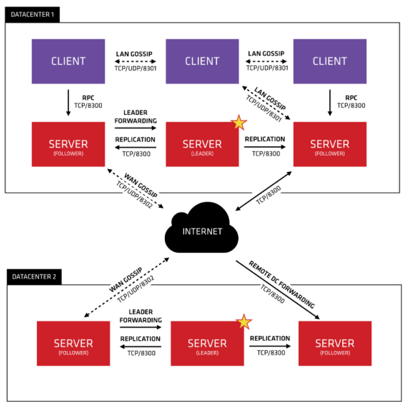

# 《Prometheus监控技术与实践》

[官方文档](https://prometheus.io/docs/introduction/overview/)

[客户端库](https://prometheus.io/docs/instrumenting/clientlibs/)


## 优点

p16


### 监控系统对比

p10


### 架构

https://prometheus.io/docs/introduction/overview/

p19


## prometheus 相关概念

### 数据模型

https://prometheus.io/docs/concepts/data_model/

P29

1. metric
2. label
3. sample
4. natation

### metric的四种类型

https://prometheus.io/docs/concepts/metric_types/

1. counter
2. gauge
3. histogram
4. summary

#### 特点

**counter**

- Counter 用于累计值，例如 记录 请求次数、任务完成数、错误发生次数。
- 一直增加，不会减少。
- 重启进程后，会被重置。

**gauge**

- Gauge 常规数值，例如 温度变化、内存使用变化。
- 可变大，可变小。
- 重启进程后，会被重置

**histogram**

​     Histogram 可以理解为柱状图的意思，常用于跟踪事件发生的规模，例如：请求耗时、响应大小。它特别之处是可以对记录的内容进行分组，提供 count 和 sum 全部值的功能。例如：{小于10=5次，小于20=1次，小于30=2次}，count=8次，sum=8次的求和值 

**summary**

​     Summary和Histogram十分相似，常用于跟踪事件发生的规模，例如：请求耗时、响应大小。同样提供 count 和 sum 全部值的功能。
例如：count=7次，sum=7次的值求值
它提供一个quantiles的功能，可以按%比划分跟踪的结果。例如：quantile取值0.95，表示取采样值里面的95%数据。 

**summary和histogram的选择**

- Summary 结构有频繁的全局锁操作，对高并发程序性能存在一定影响。histogram仅仅是给每个桶做一个原子变量的计数就可以了，而summary要每次执行算法计算出最新的X分位value是多少，算法需要并发保护。会占用客户端的cpu和内存。
- 不能对Summary产生的quantile值进行aggregation运算（例如sum, avg等）。例如有两个实例同时运行，都对外提供服务，分别统计各自的响应时间。最后分别计算出的0.5-quantile的值为60和80，这时如果简单的求平均(60+80)/2，认为是总体的0.5-quantile值，那么就错了。
- summary的百分位是提前在客户端里指定的，在服务端观测指标数据时不能获取未指定的分为数。而histogram则可以通过promql随便指定，虽然计算的不如summary准确，但带来了灵活性。
- histogram不能得到精确的分为数，设置的bucket不合理的话，误差会非常大。会消耗服务端的计算资源。

所以对比得到的总结是：

1. 如果需要聚合（aggregate），选择histograms。
2. 如果比较清楚要观测的指标的范围和分布情况，选择histograms。如果需要精确的分为数选择summary。


### jobs、instances

https://prometheus.io/docs/concepts/jobs_instances/

### 核心组件

1.  prometheus server
2. client Libray
3. Exporter
4. Pushgateway
5. Alermanager


## 部署

https://prometheus.io/docs/prometheus/latest/installation/

### 启动参数 systemd服务

p21-24


### 热加载

P25

```shell
# 查看进程发信号方式
kill -1 pid
kill -HUP pid

# http api方式,该方式启动时需指定 --web.enable-lifecycle
POST http://xxx:9090/-/reload
```


### promtool

```shell
# 核验配置文件
promtool check config prometheus.yml

promtool -h
```


## 标签

https://prometheus.io/docs/prometheus/latest/configuration/configuration/#relabel_config

## http api

https://prometheus.io/docs/prometheus/latest/querying/api/


## Exporter

https://prometheus.io/docs/instrumenting/exporters/

P38

### exporter 类型

1.  直接型

   应用内置对`prometheus`提供监控数据的断点，可直接提供数据给`prometheus`，例如`kubernetes`等

2.  间接型

   需要使用`prometheus`提供的`client library`编写该监控目标的监控采集程序，将该程序独立运行，去获取指定的各类监控数据值。各种`Node exporter`


### Node exporter

修改默认端口9100

```shell
./node_exporter --web.listen-address=":9200"

# 更多帮助信息
node_exporter -h
```

#### systemd服务配置

P43


### http、tcp 、icmp等探针类型监控

https://www.robustperception.io/tag/blackbox_exporter

P65

blackbox_exporter

以下直接在prometheus server监控，未使用exporter，但配置文件内容相同

```yaml
wget https://github.com/prometheus/prometheus/releases/download/v2.4.2/prometheus-2.4.2.linux-amd64.tar.gz
tar -xzf prometheus-*.tar.gz
cd prometheus-*
cat <<'EOF' > prometheus.yml
global:
 scrape_interval: 10s
scrape_configs:
 - job_name: blackbox
   metrics_path: /probe
   params:
     module: [http_2xx]
   static_configs:
    - targets:
       - https://www.robustperception.io/
       - http://www.cnblogs.com
   relabel_configs:
    - source_labels: [__address__]  # 将__address__写入__param_target标签来创建参数
      target_label: __param_target
    - source_labels: [__param_target] # relabel将获取__param_target的值，并覆盖写到instance标签
      target_label: instance
    - target_label: __address__ # 重新标记__address__标签。 BlockBox Exporter实例的访问地址，示例向127.0.0.1:9115/probe发送请求获取实例的metrics信息
      replacement: 127.0.0.1:9115 # The blackbox exporter.
EOF
./prometheus
```

- 第一个relabel通过将__address__标签(当前目标地址)写入__param_target标签来创建一个参数。
- 第二个relabel将__param_target标签写为实例标签。
- 最后一个使用我们的主机名(和端口)重新标记__address__标签。

<font color=FF0000>将源address地址写为查询target参数，将param_target写道instance，替换target_label为exporter所在地址</font>

每次增加 Target 时会自动增加一个 instance 标签，而 instance 标签的内容刚好对应 Target 实例的 __address__ 值，这是因为实际上 Prometheus 内部做了一次标签重写处理，默认 __address__ 标签设置为 <host>:<port> 地址，经过标签重写后，默认会自动将该值设置为 instance 标签，所以我们能够在页面看到该标签。


通过curl请求查询

```shell
curl 127.0.0.1:9115/probe?module=http_2xx&target=http://www.cnblogs.com/
```


## 服务发现

### 基于文件的服务发现

支持`JSON`和`yml`

* json

  ```shell
  # vim prometheus.yml
  scrape_configs: 
    - job_name: 'www_xxx'
      file_sd_configs:
        - files:
          - targets/www.xxx.com/*.json
          refresh_interval: 60m
  
  
  # cd prometheus
  # mkdir targets/www.xxx.com/
  # vim www_xxx_node.json
  [
      {
          "targets":[
              "10.0.0.11",
              "10.0.0.12"
          ],
          "labels":{
              "env":"www.xxx.com",
              "release":"prod"
          }
      }
  ]
  ```

  其中：file_sd_configs 指定prometheus基于文件的服务发现配置使用选项

  ​           files：自定义的和prometheus程序同级的targets目录

  ​           refresh_interval：60m 自定义刷新间隔时间味60秒

  首次添加该类服务发现需要重启或热加载

* yaml

  1.  修改vim prometheus.yml

     ```shell
     scrape_configs: 
       - job_name: 'www_xxx'
         file_sd_configs:
           - files:
             - targets/www.xxx.com/*.json
           - files:
             - targets/www.xxx.com/*.yml
             refresh_interval: 60m
     ```

  2. 添加yaml格式服务发现文件

     ```shell
     # cd prometheus
     # mkdir targets/www.xxx.com/
     # vim www_xxx_node.yml
     ```

     ```shell
     - targets:
         - 10.0.0.11
         - 10.0.0.12
       labels:
         env: www.xxx.com
         release: prod
     ```

     

### 基于consul的服务发现

p78

https://blog.csdn.net/aixiaoyang168/article/details/103022342

https://www.cnblogs.com/xiaohanlin/p/8016803.html

[ 官网consul包](https://www.consul.io/downloads.html )

[docker集群参考](https://www.cnblogs.com/xiaohanlin/p/8016803.html)

[api文档](https://www.consul.io/api/agent/service)



第一次接触consul，我就想为什么服务不直接注册到consul server上，而是中间加个consul client。看了官方文档，说说我的理解。
consul自带服务检测机制(script，HTTP，TCP，TTL，Docker，gRPC) 见:consul官网-Docs-agent-Check Definitions。以检测HTTP健康情况来说，如果一个服务注册到consul上(服务必须对外提供/health rest接口)，consul agent(consul server和consul client都是agent)定期调用该接口。如果返回200OK则认为该服务PASS。所以如果上千个服务直接注册到consul server上，那server端检测压力可想而知。
欢迎大家讨论。


#### 开发者模式启动测试

```shell
./consul agent -dev -client 0.0.0.0
```

查看下集群的状态

```shell
./consul members
```

列出注册服务

```shell
# 列出所有服务
GET 127.0.0.1:8500/v1/agent/services
# 列出node_exporter
GET 127.0.0.1:8500/v1/agent/service/node_exporter
```


#### 配置文件注册

<font color="FF0000">标签分类向下看</font>

* consul配置

  ```shell
  mkdir consul.d
  cd consul.d
  # 指定配置启动
  ./consul agent -dev -client 0.0.0.0 --config-dir=./consul.d
  ```

  编辑注册配置

  ```json
  cat node_exporter.json
  {
      "service": {
          "id": "node_exporter_171",
          "name": "node_exporter_171",
          "tags": [
              "dev_node1"
          ],
          "address": "172.16.1.171",
          "port": 32774
      }
  }
  ```

  其中：
     **`id `** 服务ID，可选。若提供，则将其设置为`name`一致
      **`name `**服务名称，必选。要求每个节点上的u偶有服务都有唯一`name`作为`id`
      **`tags `**服务标签，自定义可选项，用于区分主节点活辅助节点
      **`address`**地址字段，用于指定特定于服务的`ip`地址。默认情况下使用`agent`的`ip`地址，因而不需要提供这个地址。可以理解为服务注册到`consul`使用的`ip`，服务发现是发现的此ip地址
      **`port`**服务注册到consul使用的端口，也是发现`address`对应的端口

  **重载服务**

* prometheus集成

  ```yaml
  scrape_configs:
    - job_name: 'consul_sd_node_exporter'
      scheme: http
      consul_sd_configs:
      - server: '172.16.1.171:8500'
        services:
        - node_exporter_171 # 这里写空或不写，会加载该consul所有的srevice
  ```

  

  

  写空加载所有service，down是因为没有机器，只做测试。以下是当前所有注册service

  ```json
  curl 127.0.0.1:8500/v1/agent/services
  {
      "node-exporter-172.16.1.171": {
          "ID": "node-exporter-172.16.1.171",
          "Service": "node-exporter-172.16.1.171",
          "Tags": [
              "test_discovery"
          ],
          "Meta": {},
          "Port": 32774,
          "Address": "172.16.1.171",
          "TaggedAddresses": {
              "lan_ipv4": {
                  "Address": "172.16.1.171",
                  "Port": 32774
              },
              "wan_ipv4": {
                  "Address": "172.16.1.171",
                  "Port": 32774
              }
          },
          "Weights": {
              "Passing": 1,
              "Warning": 1
          },
          "EnableTagOverride": false,
          "Datacenter": "dc1"
      },
      "node-exporter-172.16.1.172": {
          "ID": "node-exporter-172.16.1.172",
          "Service": "node-exporter-172.16.1.172",
          "Tags": [
              "test_discovery"
          ],
          "Meta": {},
          "Port": 9100,
          "Address": "172.16.1.172",
          "TaggedAddresses": {
              "lan_ipv4": {
                  "Address": "172.16.1.172",
                  "Port": 9100
              },
              "wan_ipv4": {
                  "Address": "172.16.1.172",
                  "Port": 9100
              }
          },
          "Weights": {
              "Passing": 1,
              "Warning": 1
          },
          "EnableTagOverride": false,
          "Datacenter": "dc1"
      },
      "node_exporter_171": {
          "ID": "node_exporter_171",
          "Service": "node_exporter_171",
          "Tags": [
              "dev_node1"
          ],
          "Meta": {},
          "Port": 32774,
          "Address": "172.16.1.171",
          "TaggedAddresses": {
              "lan_ipv4": {
                  "Address": "172.16.1.171",
                  "Port": 32774
              },
              "wan_ipv4": {
                  "Address": "172.16.1.171",
                  "Port": 32774
              }
          },
          "Weights": {
              "Passing": 1,
              "Warning": 1
          },
          "EnableTagOverride": false,
          "Datacenter": "dc1"
      }
  }
  ```

  

#### http api注册

https://www.consul.io/docs/discovery/services

* `consul`配置

  ```shell
  curl -XPUT http://172.16.1.171:8500/v1/agent/service/register -d '
  {
      "name": "node-exporter-172.16.1.172", 
      "address": "172.16.1.172", 
      "port": 9100, 
      "tags": [
          "test_discovery"
      ], 
      "checks": [
          {
              "http": "http://172.16.1.172:32774/metrics", 
              "interval": "5s"
          }
      ]
  }'
  ```

  

* 与`prometheus`集成

  ```yaml
  scrape_configs:
    - job_name: 'consul_sd_node_exporter'
      scheme: http
      consul_sd_configs:
      - server: '172.16.1.171:8500'
        services:
        - node_exporter_171
  ```

  consul_sd_configs: 指定`Prometheus`是基于`Consul`的自动服务发现所使用的选项

  server：指定Consul服务地址

  service：服务名称列表（不写默认获取Consul上注册的所有服务）


#### 服务下线

```shell
curl --request PUT http://127.0.0.1:8500/v1/agent/service/deregister/node_exporter
```


#### relabel_configs 实现自定义标签及分类

[参考](https://blog.csdn.net/aixiaoyang168/article/details/103022342)

​        先来普及一下 relabel_configs 的功能， Prometheus 允许用户在采集任务设置中，通过 relabel_configs 来添加自定义的 Relabeling 的额过程，来对标签进行指定规则的重写。 Prometheus 加载 Targets 后，这些 Targets 会自动包含一些默认的标签，Target 以 `__` 作为前置的标签是在系统内部使用的，这些标签不会被写入到样本数据中。眼尖的会发现，每次增加 Target 时会自动增加一个 instance 标签，而 instance 标签的内容刚好对应 Target 实例的 __address__ 值，这是因为实际上 Prometheus 内部做了一次标签重写处理，默认 __address__ 标签设置为 <host>:<port> 地址，经过标签重写后，默认会自动将该值设置为 instance 标签，所以我们能够在页面看到该标签。


详细 relabel_configs 配置及说明可以参考 relabel_config 官网说明，这里我简单列举一下里面每个 relabel_action 的作用，方便下边演示。

* `replace`: 根据 regex 的配置匹配 source_labels 标签的值（注意：多个 source_label 的值会按照 separator 进行拼接），并且将匹配到的值写入到 target_label 当中，如果有多个匹配组，则可以使用 ${1}, ${2} 确定写入的内容。如果没匹配到任何内容则不对 target_label 进行重新， 默认为 replace。

* `keep`: 丢弃 source_labels 的值中没有匹配到 regex 正则表达式内容的 Target 实例
* `drop`: 丢弃 source_labels 的值中匹配到 regex 正则表达式内容的 Target 实例
* `hashmod`: 将 target_label 设置为关联的 source_label 的哈希模块
* `labelmap`: 根据 regex 去匹配 Target 实例所有标签的名称（注意是名称），并且将捕获到的内容作为为新的标签名称，regex 匹配到标签的的值作为新标签的值
* `labeldrop`: 对 Target 标签进行过滤，会移除匹配过滤条件的所有标签
* `labelkeep`: 对 Target 标签进行过滤，会移除不匹配过滤条件的所有标签


配置 relabel_configs 来实现标签过滤，只加载符合规则的服务。以上边为例，可以通过过滤`__meta_consul_tags `标签为 test 的服务，relabel_config 向 Consul 注册服务的时候，只加载匹配 regex 表达式的标签的服务到自己的配置文件。修改 prometheus.yml 配置如下：

```yml
scrape_configs:                 
  - job_name: 'consul_sd_node_exporter1'
    scheme: http
    consul_sd_configs:                  
    - server: '172.16.1.171:8500'
      services:       
    relabel_configs:             
    - source_labels: [__meta_consul_tags]
      regex: .*test.*
      action: keep                       
                     
  - job_name: 'consul_sd_node_exporter2'
    scheme: http
    consul_sd_configs:                  
    - server: '172.16.1.171:8500'
      services:       
    relabel_configs:             
    - source_labels: [__meta_consul_tags]
      regex: .*dev_node1.*
      action: keep
```

语法检查

```shell
promtool check config /etc/prometheus/prometheus.yml
```

结果


这里的 relabel_configs 配置作用为丢弃源标签中 __meta_consul_tags 不包含 test 标签的服务，__meta_consul_tags 对应到 Consul 服务中的值为 "tags": ["test_discovry"]，默认 consul 服务是不带该标签的，从而实现过滤。重启 Prometheus 可以看到标签已经分类成功

##### 添加自定义标签

将系统默认标签或者用户自定义标签转换成可视化标签，方便查看及后续 Alertmanager 进行告警规则匹配分组。不过要实现给服务添加自定义标签，我们还得做一下修改，就是在注册服务时，将自定义标签信息添加到 Meta Data 数据中，具体可以参考 [这里](Consul Service - Agent HTTP API) 官网说明，下边来演示一下如何操作。

```shell
$ vim consul-0.json
{
  "ID": "node-exporter",
  "Name": "node-exporter-172.30.12.167",
  "Tags": [
    "test"
  ],
  "Address": "172.30.12.167",
  "Port": 9100,
  "Meta": {
    "app": "spring-boot",
    "team": "appgroup",
    "project": "bigdata"
  },
  "EnableTagOverride": false,
  "Check": {
    "HTTP": "http://172.30.12.167:9100/metrics",
    "Interval": "10s"
  },
  "Weights": {
    "Passing": 10,
    "Warning": 1
  }
}
```

 说明一下：该 Json 文件为要注册的服务信息，同时往 Meta 信息中添加了 `app=spring-boot`，`team=appgroup`，`project=bigdata` 三组标签，目的就是为了方便告警分组使用。执行如下命令进行注册： 

```yaml
...
- job_name: 'consul-prometheus'
  consul_sd_configs:
    - server: '172.30.12.167:8500'
      services: []  
  relabel_configs:
    - source_labels: [__meta_consul_tags]
      regex: .*test.*
      action: keep
    - regex: __meta_consul_service_metadata_(.+)
      action: labelmap

```

解释一下，增加的配置作用为匹配 __meta_consul_service_metadata_ 开头的标签，将捕获到的内容作为新的标签名称，匹配到标签的的值作为新标签的值，而我们刚添加的三个自定义标签，系统会自动添加 __meta_consul_service_metadata_app=spring-boot、__meta_consul_service_metadata_team=appgroup、__meta_consul_service_metadata_project=bigdata 三个标签，经过 relabel 后，Prometheus 将会新增 app=spring-boot、team=appgroup、project=bigdata 三个标签。重启 Prometheus 服务，可以看到新增了对应了三个自定义标签。


### 基于dns

`dns_sd_configs`


## 配置文件分离

P70

使用`file_sd_configs` 创建json文件类型


## 客户端库使用

https://prometheus.io/docs/instrumenting/clientlibs/

[golang SDK](https://github.com/prometheus/client_golang)

[golang SDK文档](https://pkg.go.dev/github.com/prometheus/client_golang/prometheus#Counter)


