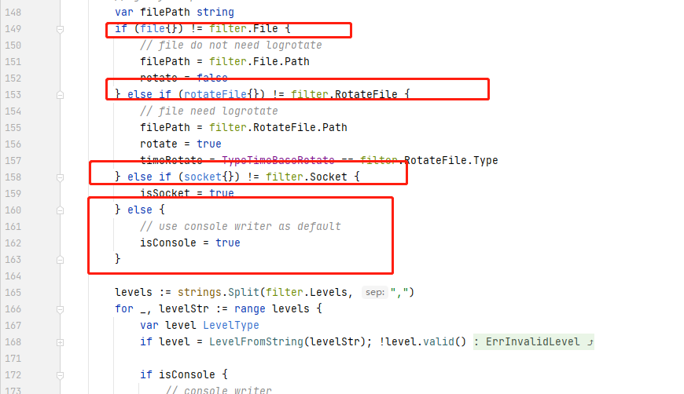

# blog4go

调用方法简单

BLog4go 是高性能日志库。创新地使用“边解析边输出”方法进行日志输出，同时支持回调函数、日志淘汰和配置文件。可以解决高并发，调用日志函数频繁的情境下，日志库造成的性能问题。 


Prometheus  源码
245页


config.xml

源码下对于不通日志输出输入模式的判断



```xml
<blog4go minlevel="info">
    <filter levels="trace">
<!--        <rotatefile path="trace.log" type="time"></rotatefile>-->
    </filter>
    <filter levels="debug" colored="true">
<!--        <file path="debug.log"></file>-->
    </filter>
    <filter levels="info" colored="true">
<!--        <file path="info.log"></file>-->
    </filter>
    <filter levels="error,critical">
        <rotatefile path="error.log" type="size" rotateSize="50000000" rotateLines="8000000"></rotatefile>
    </filter>
</blog4go>
```


```golang
package main

import (
	log "github.com/YoungPioneers/blog4go"
	"fmt"
	"os"
	"time"
)

// optionally set user defined hook for logging
type MyHook struct {
	message string
}

// when log-level exceed level, call the hook
// level is the level associate with that logging action.
// message is the formatted string already written.
func (m *MyHook) Fire(level log.LevelType,tags map[string]string,message ...interface{}) {
	now := time.Now()
	msg := fmt.Sprintln(message...)
	t := now.Format("2006-01-02_15:04:05")
	//tags = map[string]string{"first":"abc","second":"cde"}
	fmt.Printf("%s %s %s",t,level,msg)
}

func main() {
	// 加载配置文件
	// init a file write using xml config file
	// log.SetBufferSize(0) // close buffer for in time logging when debugging
	err := log.NewWriterFromConfigAsFile("config.xml")
	if nil != err {
		fmt.Println(err.Error())
		os.Exit(1)
	}
	defer log.Close()

	// 初始化回调钩子
	// initialize your hook instance
	
	//hook := new(MyHook)
	//log.SetHook(hook) // writersFromConfig can be replaced with writers
	//log.SetHookLevel(log.INFO)
	//log.SetHookAsync(true) // 异步模式调用钩子

	// optionally set output colored  可选输出日志颜色
	log.SetColored(false)

	log.Debugf("Good morning, %s", "eddie")
	log.Warn("It's time to have breakfast")
	log.Info("xxxx")
}
```


github

https://github.com/YoungPioneers/blog4go


1. 加载配置文件
2. 构建bhook实力hook
3. 导入包，直接输出即可

```golang
package main

import (
	log "github.com/YoungPioneers/blog4go"
	"fmt"
	"os"
)

// optionally set user defined hook for logging
type MyHook struct {
	something string
}

// 回调函数用于在终端显示输入日志，简单，无时间格式
// when log-level exceed level, call the hook
// level is the level associate with that logging action.
// message is the formatted string already written.
func (self *MyHook) Fire(level log.LevelType, tags map[string]string,args ...interface{}) {
	fmt.Println(args...)
}

func main() {
	// init a file write using xml config file
	// log.SetBufferSize(0) // close buffer for in time logging when debugging
	// 初始化配置文件
	err := log.NewWriterFromConfigAsFile("config.xml")
	if nil != err {
		fmt.Println(err.Error())
		os.Exit(1)
	}
	defer log.Close()

	// initialize your hook instance，设置钩子
	hook := new(MyHook)
	log.SetHook(hook) // writersFromConfig can be replaced with writers
	// 日志级别
	log.SetHookLevel(log.INFO)
	log.SetHookAsync(true) // hook will be called in async mode

	// optionally set output colored
	// 设置日志颜色
	log.SetColored(true)

    // 输出日志内容
	log.Debugf("Good morning, %s", "eddie")
	log.Warn("It's time to have breakfast")
}
```


